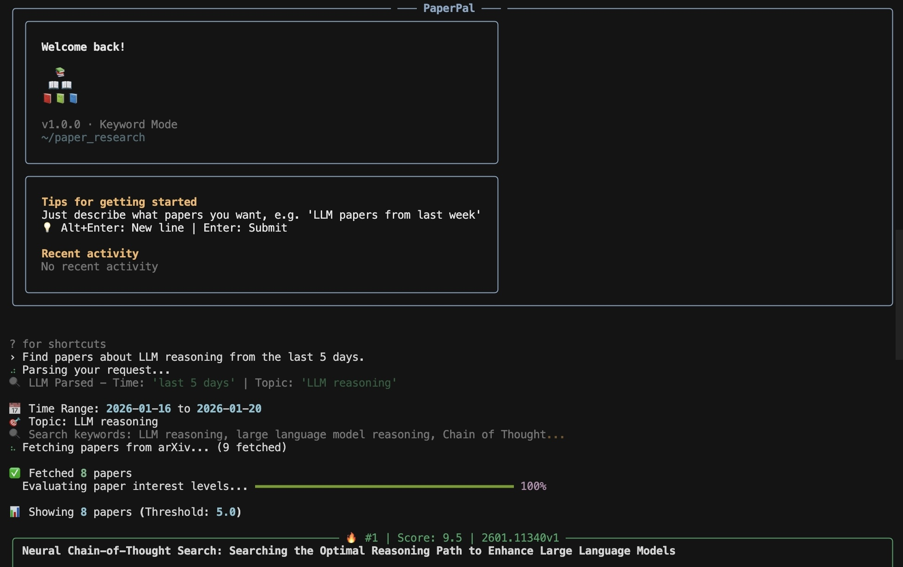

# 🔬 PaperPal

An intelligent AI-powered research assistant that helps you discover and analyze the latest arXiv papers with personalized scoring and interactive navigation.

[中文文档 (Chinese Documentation)](README_ZH.md)

## ✨ Key Features

- 🎯 **Smart Recommendations**: AI analyzes and scores papers based on your specific research interests.
- ⚡ **Dual Search Modes**: **Thorough Exhaustive Search** (scans all papers in selected categories to ensure no relevant literature is missed) or fast keyword filtering (faster speed).
- 🗣️ **Natural Language Interaction**: Just tell it what you want (e.g., "Find LLM papers from last week"). You can also analyze and discuss the search results in depth.
- 🧠 **Preference Learning**: Automatically learns your tastes from feedback and compresses memory for better suggestions.
- 📊 **Beautiful Terminal UI**: Rich formatting with progress bars, color-coded scores, and panels.
- 💾 **Auto Export**: Results are automatically saved as well-formatted Markdown files.



---

## 🚀 Quick Start

### 1. Install
```bash
git clone https://github.com/Shenzhi-Wang/PaperPal.git
cd PaperPal
pip install -e .
```

### 2. Configure
The first time you run it, the program will prompt you for your API key. Alternatively, create a `.env` file:
```env
OPENAI_API_KEY=sk-your-key
OPENAI_BASE_URL=https://api.openai.com/v1  # Compatible with DeepSeek, etc.
OPENAI_MODEL=gpt-4o-mini
```

### 3. Run
```bash
# Start interactive mode (Recommended)
paper

# Or use quick search
paper search -t "3 days" -T "Reinforcement Learning"
```

---

## 🎮 Interactive Commands

| Command       | Description                                                        |
| ------------- | ------------------------------------------------------------------ |
| `/search`     | Toggle between Keyword and Exhaustive modes                        |
| `/categories` | Interactively select ArXiv categories (↑↓ + Space)                 |
| `/summary`    | Generate a comprehensive research overview of current/past results |
| `/memory`     | View or adjust what the AI has learned about your interests        |
| `/files`      | Browse and view past search results                                |
| `/settings`   | Adjust language, workers, and output directories                   |
| `/quit`       | Exit the program                                                   |

---

## 🤖 Smart Features

### ⌨️ Modern Navigation
Forget typing numbers. In all menus and the category selector, use:
- **↑ / ↓**: Move cursor
- **Space**: Toggle checkboxes (in Categories)
- **Enter**: Confirm selection
- **Esc / q**: Go back

### 📝 Intelligent Summaries
PaperPal doesn't just list papers. Use `/summary` to get a structured overview that identifies emerging trends, common methodologies, and key innovations across multiple papers.

### 🧠 Preference Memory
The more you use PaperPal, the better it gets. It records your feedback (e.g., "Paper 1 is great, skip Paper 3") and maintains a natural language "memory" of your research persona.

---

## 🛠️ Configuration
Edit `config.py` for advanced settings like:
- `AUTO_SUMMARY`: Auto-generate research summary after search (Default: True).
- `DEFAULT_ARXIV_CATEGORIES`: Your default search domain.
- `INTEREST_THRESHOLD`: Minimum score (0-10) to display a paper.
- `MAX_WORKERS`: Number of parallel threads for AI scoring.

---

## 📄 License
MIT License. Created by [Shenzhi-Wang](https://github.com/Shenzhi-Wang).
